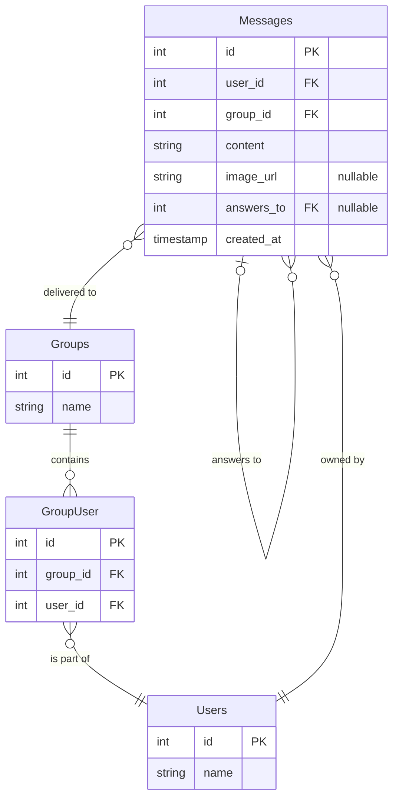

# Base de Datos Relacionales
## Tarea 2

### Instrucciones
- Convierte to base de datos no estructurada en un modelo entidad-relación, representándolo con un diagrama entidad-relación. Usa nodos con figuras correctas y aristas claramente señaladas con los números correspondientes para las relaciones.
- Muestra el dominio de los atributos.
- Subir esta descripción en un archivo markdown o PDF nombrado claramente (tarea 2 o algo por el estilo).

### Diagrama entidad relación
Encontre un dataset en kaggle que se acopla al objetivo de mi base de datos estructurada. [Link](https://www.kaggle.com/datasets/aagghh/crypto-telegram-groups/)

