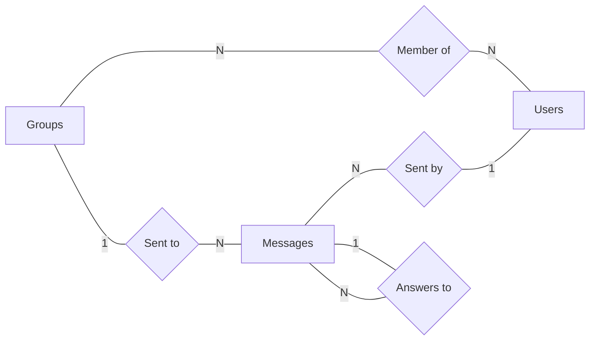

# Base de Datos Relacionales

## Tarea 3

### Instrucciones

- Crea un esquema del modelo relacional de tu base de datos a partir del modelo e-r de la tarea anterior.
- Representa con un diagrama relacional tu esquema del punto anterior.
- Encuentra cuatro operaciones que vayas a usar en tu base de datos y exprésalas mediante operaciones de álgebra relacional. Explica con tus propias palabras cada una de esas operaciones.

### Esquema modelo relacional

#### Groups

- **id** (PK)
- name

#### GroupUser

- **group_id** (PK) (FK -> Groups.id)
- **user_id** (PK) (FK -> Users.id)

#### Users

- **id** (PK)
- name

#### Messages

- **id** (PK)
- **group_id** (FK -> Groups.id)
- **user_id** (FK -> Users.id)
- content
- image_url
- **answers_to** (FK -> Messages.id)
- created_at

### Diagrama relacional

En la tarea 2 realicé un diagrama relacional, por lo que ahora haré un diagrama e-r.

### Operaciones algebra relacional

#### Mensajes de un usuario

σ{Users.name = "Pato"}(Messages ⨝{Messages.user_id = Users.id} Users)

Primero se hace un join de los mensajes con los usuarios que mandaron los mensajes, y despues se filtran los mensajes mandados por el usuario con el nombre Pato.

#### Contenido de mensajes de un usuario en un grupo

π{Messages.id, Messages.content}(σ{Users.name = "Pato"}(Messages ⨝{Messages.user_id = Users.id} Users)) ∩ π{Messages.id, Messages.content}(σ{Groups.name = "UANL"}(Messages ⨝{Messages.group_id = Groups.id} Groups))

Del lado izquierdo primero se hace un join de los mensajes con los usuarios que mandaron los mensajes, despues se filtran los mensajes mandados por el usuario con el nombre Pato, y al final se agarran las columnas id y content de los mensajes.
Del lado derecho primero se hace un join de los mensajes con los grupos a los que fueron mandados los mensajes, despues se filtran los mensajes que pertenecen al grupo con el nombre UANL, y al final se agarran las columnas id y content de los mensajes.
Por ultimo se calcula la interseccion de los mensajes del usuario llamado Pato con los mensajes del grupo llamado UANL.

#### Contenido de mensaje y respuesta

π{Messages.content, Answers.content}((Messages ⨝{Messages.id = Answers.answers_to} ρ{Answers}(Messages - σ{Messages.answers_to = Null}(Messages))))

Primero agarro todos los mensajes de la tabla, y le resto los mensajes donde answers_to es igual a null, este resultado lo renombro como Answers para poder realizar una relació recursiva, despues se hace el join de la tabla Messages a la tabla Answers en donde Answers.answers_to es igual a Messages.id, y por ultimo se agarra las columnas contenido de las tablas Messages y Answers.

#### Todas las imagenes de un grupo

π{Messages.image_url}(σ{Groups.name = "UANL" ^ Messages.image_url != Null}(Messages ⨝{Messages.group_id = Groups.id} Groups))

Primero se hace un join de los mensajes con los grupos a los que fueron mandados los mensajes, despues se filtran los mensajes que pertenecen al grupo con el nombre UANL y cullo image_url no es igual a Null, y por ultimo se agarra la columna image_url de los mensajes.
